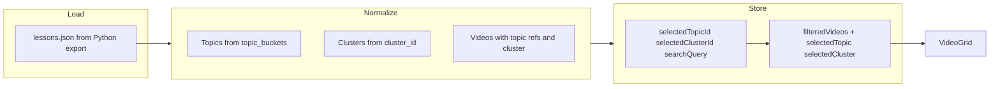

# Topic Browser (Vite React) — implementation plan

## Validation against current `web/index.html`

These facts anchor the new app in real behavior today:

- **Topic area:** The page renders **`DATA.topic_tree`** (not `topictree`) from `data.js`. Labels use **"Level N — "** for levels 1–3 in the inline script (~lines 96–100).
- **Video grid:** Built from **`DATA.lessons`**, filtered only by **`lessonMatches`** on `title`, `core_lesson`, `summary_text`, and `key_concepts`. **Topic and cluster selections do not affect the grid**—only search does.
- **Search:** The input uses **`addEventListener('input', render)`**, so results **update as you type** (instant), not on Enter. There is **little affordance** that the list below changes, and **search / topic tree / clusters / videos** feel visually disconnected.

**Implication:** Moving to **topics from `topic_buckets` + clusters from `cluster_id`** matches data the pipeline already exports; the static page simply never wired those fields into filtering. Counts must be derived from the same lesson rows the grid uses so **sidebar counts and grid never disagree** (fixing e.g. Mindfulness in `topic_tree.json` with empty `recommended_video_ids`).

---

## Context in this repo

- Static export: [`web/summary_page.py`](web/summary_page.py) → `web/data.js` (`window.SA_LESSONS_DATA`).
- [`data/topic_tree.json`](data/topic_tree.json) is **LLM-authored curriculum** (`recommended_video_ids`, etc.). **Topic Browser v1 does not read this file.** Document in README / a short comment in the app entry or `normalize.ts` that it is reserved for a future **“Learning paths”** feature only.

**Design decision:** **Topics** = curated tags aggregated from **`topic_buckets`**. **Clusters** = **`cluster_id` + `cluster_name`**. **`videoCount`** on topics and clusters = **count of lessons** in that bucket or cluster, so **always consistent** with the normalized video list and any filter combination.

---

## 1. Scaffold the frontend

- Create [`topic-browser/`](topic-browser/) with **Vite + React + TypeScript** (`npm create vite@latest topic-browser -- --template react-ts`).
- **No React Router in v1** — single view is enough. **Query-param sync** (`?topic=&cluster=&q=`) is **phase 2** (shareable URLs); do not overbuild routing early.
- Styling: **Tailwind CSS**, **Zustand**, **lucide-react** (search icon, etc.). Optional **Radix** for tooltip.

---

## 2. Data loading (single source of truth)

**Confirmed approach:** Generate **`topic-browser/public/lessons.json`** from the existing Python export. Shape matches **`window.SA_LESSONS_DATA.lessons`** as plain JSON (array of lesson objects). The Topic Browser **only** reads this file for v1—no runtime dependency on `topic_tree.json`.

Extend [`web/summary_page.py`](web/summary_page.py) (or a small post-step) to write `lessons.json` next to or instead of relying on manual copy, so `npm run dev` picks up fresh data after the pipeline runs.

---

## 3. Types and normalizer

**[`src/types.ts`](topic-browser/src/types.ts)** — explicit exports:

- `LessonRaw` — at minimum: `transcript_id`, `title`, `topic_buckets: string[]`, `cluster_id: number | null`, `cluster_name: string | null`, plus fields already present on lessons today (`url`, `summary_text`, `core_lesson`, `key_concepts`, `difficulty`, `wordcloud_path`, etc.) so cards can show rich metadata.
- `Topic` — `{ id: string; name: string; videoCount: number }` — `id` from normalized bucket string (slug/hash).
- `Cluster` — `{ id: number; name: string; videoCount: number }`.
- `Video` — `{ id: number; title: string; topics: Topic[]; cluster: Cluster | null; ... }` — use **`cluster: Cluster | null`** (one cluster per lesson in this export), not `clusters[]`, unless the data model later supports multi-cluster per video.

**[`src/data/normalize.ts`](topic-browser/src/data/normalize.ts):**

- Input: `LessonRaw[]`.
- Output: `{ topics: Topic[]; clusters: Cluster[]; videos: Video[] }`.
- Compute **`videoCount`** for topics and clusters **only** from membership in `topic_buckets` and `cluster_id`, so counts **always align** with the grid and filters (no `topic_tree` / `recommended_video_ids`).

---

## 4. Global state (Zustand)

**[`src/store/useTopicBrowserStore.ts`](topic-browser/src/store/useTopicBrowserStore.ts):**

- State: `selectedTopicId: string | null`, `selectedClusterId: number | null`, `searchQuery: string`, `allTopics`, `allClusters`, `allVideos` (hydrated once from normalize).
- Selectors / derived: **`filteredVideos`** (topic ∩ cluster ∩ debounced search over title, topic names, cluster name; optionally `core_lesson` / summary if present in JSON to match old `lessonMatches` breadth), **`selectedTopic`**, **`selectedCluster`**.

---

## 5. Search behavior (preserve + improve)

- **Preserve** the mental model of **search updating as you type** (like current `input` → `render`).
- Implement **debounced updates** to `searchQuery` (300–500 ms) to avoid thrashing while still feeling instant; on Enter or search button, **flush** immediately to the same handler.
- Add **visible feedback** when results change: short **fade-in** on the grid, optional **“Results updated”** microcopy, **loading shimmer** on initial load.
- **Mobile:** `scrollIntoView` on the video grid region when filters/search change.

---

## 6. Layout and components (file map)

| File | Role |
|------|------|
| [`src/components/layout/AppLayout.tsx`](topic-browser/src/components/layout/AppLayout.tsx) | Header (title + search), grid: **left column** (Topics + Clusters), **main** (ActiveFiltersBar + VideoGrid). |
| [`src/components/sidebar/TopicList.tsx`](topic-browser/src/components/sidebar/TopicList.tsx) | Heading **“Topics”** (never “Topic tree”, never **“Level N —”**). Helper: *“Topics are curated tags; clusters are auto-discovered themes.”* (Can split: Topics line under Topics, one line under Clusters if cleaner.) List: **Name (count)**; selected styling. |
| [`src/components/sidebar/ClusterList.tsx`](topic-browser/src/components/sidebar/ClusterList.tsx) | Same pattern for clusters; counts from normalized data. |
| [`src/components/search/SearchBar.tsx`](topic-browser/src/components/search/SearchBar.tsx) | Placeholder *“Search videos by title, topic, or cluster…”*, helper *“Results update as you type.”*, icon button + Enter. |
| [`src/components/filters/ActiveFiltersBar.tsx`](topic-browser/src/components/filters/ActiveFiltersBar.tsx) | Pills with **×**; *“Showing N videos for: …”*. |
| [`src/components/videos/VideoGrid.tsx`](topic-browser/src/components/videos/VideoGrid.tsx) | `filteredVideos`, loading / empty states. |
| [`src/components/videos/VideoCard.tsx`](topic-browser/src/components/videos/VideoCard.tsx) | Single card presentation. |

**Copy note:** Use **“Topics”** not **“Topic tree”**. Optional combined helper under the main title: *“Topics are curated tags; clusters are auto-discovered themes.”*

---

## 7. Deprecations and phase 2

- **`topic_tree.json`:** Not read by Topic Browser **v1**. Comment in code + one line in repo docs (e.g. README or `topic-browser/README.md`): reserved for future **Learning paths** only.
- **URL / query sync:** Planned **phase 2**; not required to ship v1.

---

## 8. What we are not doing in v1

- Nested topic tree UI from `topic_tree.json`.
- Replacing [`web/index.html`](web/index.html) until you explicitly switch the official browse experience.

---

## Architecture sketch

---

## Prompt snippet for implementation (optional)

> Create `topic-browser/` with Vite + React + TypeScript (`react-ts`). Read **`public/lessons.json`** (shape = `SA_LESSONS_DATA.lessons`). Implement `src/types.ts`, `src/data/normalize.ts`, `src/store/useTopicBrowserStore.ts` as in the plan. Build `AppLayout`, `TopicList`, `ClusterList`, `SearchBar`, `ActiveFiltersBar`, `VideoGrid`, `VideoCard`. Tailwind + Zustand. Topics from `topic_buckets`, clusters from `cluster_id`; **do not** load `topic_tree.json`. No “Level 1 —”. Filter grid by topic + cluster + debounced search. Pills, fade-in, mobile `scrollIntoView`. Generate `lessons.json` from `summary_page.py` export.

---

## Deviation from generic `npm create` line

- Use **`--template react-ts`** for first-class TypeScript.
