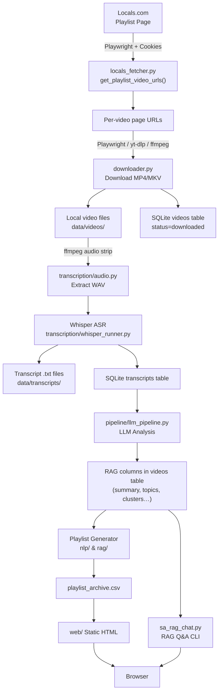
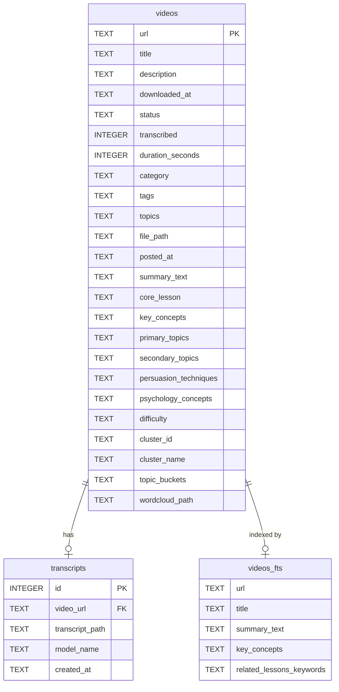

# System Architecture

SA Locals RAG is a multi-stage data pipeline that transforms raw video content into a searchable, AI-analyzed knowledge base with playlist generation.

---

## High-Level Overview

```
 Locals.com  ──►  Playlist Fetcher  ──►  Video Downloader  ──►  Audio Extractor
                                                                        │
                                                                  Whisper ASR
                                                                        │
                                                              SQLite (transcripts)
                                                                        │
                                                               LLM Pipeline
                                                            (topics, concepts, clusters)
                                                                        │
                                                          Playlist Generator
                                                                        │
                                                           Static Web UI / RAG Chat
```

---

## Detailed Data Flow



---

## Component Map

| Component | Files | Responsibility |
|---|---|---|
| **Auth** | `locals_auth.py` | Browser-based login; saves Netscape cookie file |
| **Fetcher** | `locals_fetcher.py` | Playwright crawl of playlist pages; extract post URLs and stream URLs |
| **Downloader** | `downloader.py` | Download videos via HLS (ffmpeg), yt-dlp, or direct requests |
| **Database** | `db.py` | SQLite init, migration, UPSERT helpers, FTS5 virtual table |
| **Transcription** | `transcription/` | Audio extraction (ffmpeg), Whisper ASR, DB sync |
| **LLM Pipeline** | `pipeline/llm_pipeline.py` | OpenAI calls to extract topics, clusters, difficulty, and more |
| **NLP / Clustering** | `nlp/` | Text clustering, topic bucket assignment |
| **RAG** | `rag/` | Retrieval-augmented generation helpers |
| **Web UI** | `web/` | Static HTML playlist page generation |
| **RAG Chat** | `sa_rag_chat.py` | Interactive CLI Q&A against the transcript DB |
| **Help Indexer** | `help_indexer/` | Indexes external help/docs for use in RAG context |
| **Config** | `config.py`, `.env` | Central configuration via environment variables |

---

## Storage Architecture



---

## Technology Stack

| Layer | Technology |
|---|---|
| Browser automation | Playwright (Chromium) |
| Video download | yt-dlp, ffmpeg, requests |
| Audio transcription | OpenAI Whisper (local) |
| Storage | SQLite 3 + FTS5 |
| LLM analysis | OpenAI API (GPT-4o / GPT-3.5) |
| Web UI | Static HTML/CSS/JS |
| Python runtime | Python 3.11+ |
