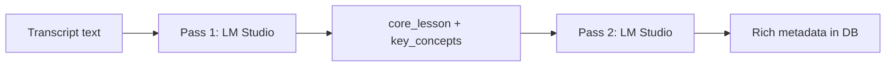
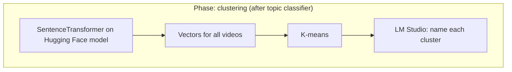
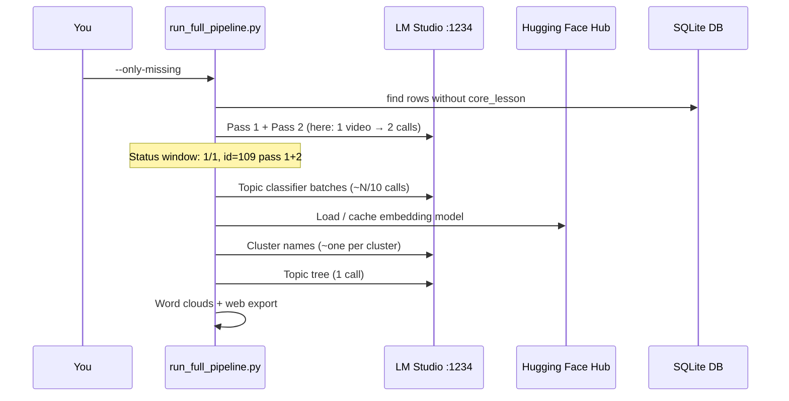
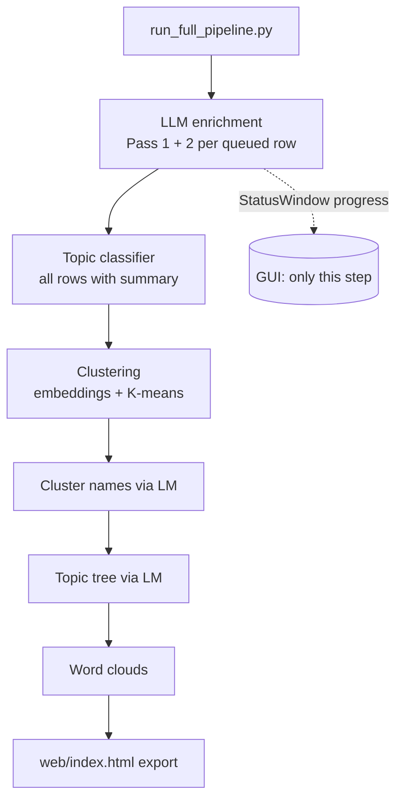

# What `run_full_pipeline.py` Actually Does (Plain English)

This document explains a typical run like:

```text
python run_full_pipeline.py --only-missing
```

for someone who does not know the codebase.

---

## The one-sentence story

The app downloads and transcribes videos, stores them in SQLite, then **enriches** each lesson with AI (local LM Studio), **classifies** topics for all lessons, **groups** similar lessons with math + AI labels, builds a **topic tree**, draws **word clouds**, and exports a **static web summary**.

`--only-missing` only changes **which rows get the first enrichment step** (videos that still lack a `core_lesson`). It does **not** skip the later steps that touch **every** summary in the database.

---

## Why you saw `id=109` but “1 video”

- **`t.id` (transcript id)** is an auto-increment primary key in SQLite. It is **not** “video #109 out of 260” in a simple sense; ids can have gaps if rows were deleted or inserted out of order.
- **“This run: 1 video(s) queued”** means: only **one** transcript row matched `--only-missing` (the only one still missing `core_lesson`). That row happened to have `id=109`.

So the pipeline really did only **one** enrichment *job*, but that job’s database id is 109.

---

## Pass 1 and Pass 2 (the GUI lines)

The LLM step is intentionally **two-pass** (see `pipeline/llm_pipeline.py`):

| Pass | Input | Output (stored on `videos`) |
|------|--------|-----------------------------|
| **1** | Raw transcript text | `core_lesson`, `key_concepts`, `complexity_indicators`, and `summary_text` (copy of the one-line lesson) |
| **2** | Pass 1 summary + key concepts (not the full transcript) | `primary_topics`, difficulty, techniques, keywords for search, etc. |

Why two passes? Smaller, focused prompts: first extract the core lesson from a long transcript; then add structured metadata without stuffing the whole transcript into the second call again.

The status window logs **two lines** for the same `id` on success: `pass=1` then `pass=2`. That is **one video**, two stages.



---

## Why Hugging Face (`huggingface.co`) appeared

That traffic is **not** the chat model in LM Studio. It comes from **Sentence Transformers** loading the embedding model `all-MiniLM-L6-v2` during **clustering** (`nlp/cluster_videos.py`).

- The pipeline turns each lesson’s summary (plus some fields) into a **vector** (embedding).
- **K-means** assigns each video to a cluster number.
- A separate step asks LM Studio to **name** each cluster from sample titles/summaries.

HEAD/GET requests to Hugging Face are the library checking the cache and downloading model **weights/tokenizer** if needed. The `adapter_config.json` **404** is normal for this model (no PEFT adapter). The `HF_TOKEN` warning is optional (higher rate limits if you set a token).



---

## Why LM Studio kept getting POST requests “after” the video looked done

`run_full_pipeline.py` runs **several** steps that each talk to `http://localhost:1234/v1/chat/completions`. The **Tkinter “SA Locals RAG — pipeline” window** is wired only to **`llm_pipeline.run_llm_pipeline`** (the Pass 1 / Pass 2 enrichment). When that step finishes, the bar shows **1/1** and the log shows both passes for `id=109`.

**After that**, the script continues **without** driving that same progress UI:

1. **Topic classifier** (`nlp/topic_classifier.py`) — batches **all** videos that have `summary_text` (default **10 per batch**) and asks LM Studio for topic labels. With ~260 videos, expect on the order of **26** HTTP calls, not 2.
2. **Clustering** — loads embeddings (Hugging Face), runs K-means, then **one LM Studio call per cluster** (default **15** clusters) to produce human-readable cluster names.
3. **Topic tree** (`nlp/build_topic_tree.py`) — **one** more LM Studio call to build `data/topic_tree.json` from sampled summaries.
4. **Word clouds** — local processing (no LM Studio).
5. **Web export** — writes static HTML/JS (no LM Studio).

So the **first long burst** of POST lines is usually: **2** (pass 1+2 for the one missing row) **+ ~26** (topic classifier batches). The burst **after** “Load pretrained SentenceTransformer” is usually: **~15** (cluster naming) **+ 1** (topic tree), plus whatever your log truncation shows.



---

## End-to-end pipeline map



---

## How to view the diagrams

- **GitHub / GitLab**: this file renders Mermaid in many viewers.
- **VS Code**: use a Markdown preview extension with Mermaid support.
- **Browser**: paste any `mermaid` block into [https://mermaid.live](https://mermaid.live).

---

## Quick reference: what talks to what

| Component | Talks to LM Studio? | Talks to Hugging Face? |
|-----------|---------------------|-------------------------|
| `pipeline/llm_pipeline.py` | Yes (Pass 1 + 2) | No |
| `nlp/topic_classifier.py` | Yes (batched) | No |
| `nlp/cluster_videos.py` | Yes (per cluster naming) | Yes (embedding model) |
| `nlp/build_topic_tree.py` | Yes (one call) | No |
| `wordclouds/` | No | No |
| `web/summary_page.py` | No | No |
