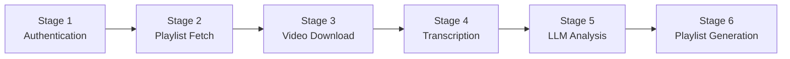
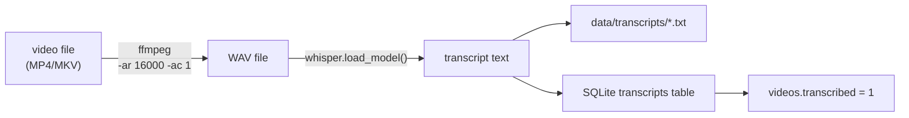

# Pipeline Stage Reference

The SA Locals RAG pipeline has five main stages. Each can be run independently or all at once via `run_full_pipeline.py`.

---

## Stage Overview



---

## Stage 1 — Authentication

**Module**: `locals_auth.py`  
**Triggered by**: Any stage that requires Locals.com access  

Uses Playwright to navigate the Locals.com login page, enter credentials, wait for the session to establish, and export all cookies to a Netscape-format `.txt` file. Subsequent stages use this cookie file for authenticated requests without re-launching a browser.

### Process

1. Playwright launches a headless Chromium browser
2. Navigates to `https://locals.com/sign-in`
3. Fills in email and password fields
4. Waits for a successful redirect
5. Writes cookies to `LOCALS_COOKIES_PATH`

### Key Function

```python
from locals_auth import login_and_save_cookies

ok = login_and_save_cookies(
    email="user@example.com",
    password="secret",
    cookies_path="locals_cookies.txt",
    headless=True,
)
```

---

## Stage 2 — Playlist Fetch

**Module**: `locals_fetcher.py`  
**Key Function**: `get_playlist_video_urls()`

Loads the target playlist page using Playwright with the saved cookies. Because Locals.com is a JavaScript-rendered SPA, Playwright waits for `networkidle` and then **scrolls incrementally** to trigger infinite scroll, collecting all post URLs.

### Process

1. Load the playlist URL with injected cookies
2. Wait for page to reach `networkidle`
3. Scroll `document.body.scrollHeight` up to 80 times, waiting 2.5 s each scroll
4. After 2 consecutive scrolls with no new URLs, stop
5. Parse `<a href>` tags filtering for `post=` parameters
6. Return a deduplicated, ordered list of absolute URLs

### Scroll Strategy

Locals.com uses infinite scroll with approximately 260 videos. The fetcher detects stagnation (no new post URLs after two consecutive scroll batches) and stops, keeping scroll iterations to a minimum.

### Video Stream URL Extraction

For each post URL, `get_video_info_and_stream_url()` tries the following methods in order:

1. **HTML scrape** — regex-search the raw page HTML for `webapi.locals.com/.../*.m3u8?vt=...`
2. **Playwright network capture** — intercept all `response` events matching `.m3u8` or `.mp4`
3. **Video element inspection** — read `video.src` from the DOM
4. **API probe** *(optional, disabled by default)* — query `webapi.locals.com/api/v1/posts/{id}` directly

---

## Stage 3 — Video Download

**Module**: `downloader.py`  
**Entry point**: `main.py`

For each URL not yet in the database (status `downloaded`), downloads the video using one of three fallback strategies:

| Priority | Strategy | Tool | Use Case |
|---|---|---|---|
| 1 | HLS stream download | ffmpeg | When an `.m3u8` URL with `vt=` JWT token is available |
| 2 | yt-dlp | yt-dlp | When yt-dlp can extract the video natively |
| 3 | Direct requests | requests | When a direct `.mp4` URL is known |

### Retry Utilities

- `retry_failed_hls.py` — re-attempts all `status=failed` rows using fresh stream URLs
- `redownload_duplicate_failed.py` — resolves duplicate file path issues and re-downloads
- `fix_duplicate_filepaths.py` — database maintenance to de-duplicate `file_path` entries

---

## Stage 4 — Transcription

**Module**: `transcription/`  
**Entry point**: `run_transcription.py`

### Sub-modules

| File | Role |
|---|---|
| `transcription/audio.py` | Extract mono 16 kHz WAV from video using ffmpeg |
| `transcription/whisper_runner.py` | Run OpenAI Whisper on the extracted WAV file |
| `transcription/pipeline.py` | Orchestrate per-video audio extract → transcribe → save |
| `transcription/sync.py` | Sync transcripts found on disk back into the database |
| `transcription/cli.py` | CLI entry point with argument parsing |
| `transcription/config.py` | Transcription-specific config (model, device, dirs) |

### Process



### Whisper Model Selection

Choose the model based on your hardware and accuracy requirements:

| Model | VRAM | Speed | Accuracy |
|---|---|---|---|
| `tiny` | ~1 GB | Fastest | Basic |
| `base` | ~1 GB | Fast | Good |
| `small` | ~2 GB | Moderate | Better |
| `medium` | ~5 GB | Slow | Great |
| `large` | ~10 GB | Very slow | Best |

---

## Stage 5 — LLM Analysis

**Module**: `pipeline/llm_pipeline.py`  
**Entry point**: `run_full_pipeline.py` (or run the module directly)

For each transcribed video, sends the transcript text to the OpenAI API with a structured prompt. The response is parsed and written back to the `videos` table as separate columns.

### Extracted Fields

| Column | Description |
|---|---|
| `summary_text` | 2–4 sentence summary of the video |
| `core_lesson` | The single most important takeaway |
| `key_concepts` | Comma-separated list of key concepts |
| `primary_topics` | Top-level topic categories |
| `secondary_topics` | Supporting/related topics |
| `persuasion_techniques` | Persuasion or rhetoric techniques used |
| `psychology_concepts` | Psychological principles referenced |
| `difficulty` | Estimated audience difficulty (Beginner/Intermediate/Advanced) |
| `prerequisites` | Knowledge assumed before watching |
| `builds_toward` | What this video prepares the viewer for |
| `related_lessons_keywords` | Keywords linking to other videos |
| `tone` | Descriptive tone (e.g., analytical, motivational) |
| `use_cases` | Practical applications of the content |
| `is_persuasion_focused` | Boolean (1/0) flag |
| `topic_buckets` | High-level bucket categories for playlist grouping |
| `cluster_id` | Assigned cluster number (from embedding clustering) |
| `cluster_name` | Human-readable cluster label |

---

## Stage 6 — Playlist Generation

**Module**: `nlp/`, `rag/`, `web/`  
**Output**: `playlist_archive.csv`, static HTML in `web/`

Using `topic_buckets` and `cluster_id`, videos are grouped into thematic playlists. The web output produces a browsable static HTML page with playlist navigation, video cards showing title, summary, topics, and links back to Locals.com.
